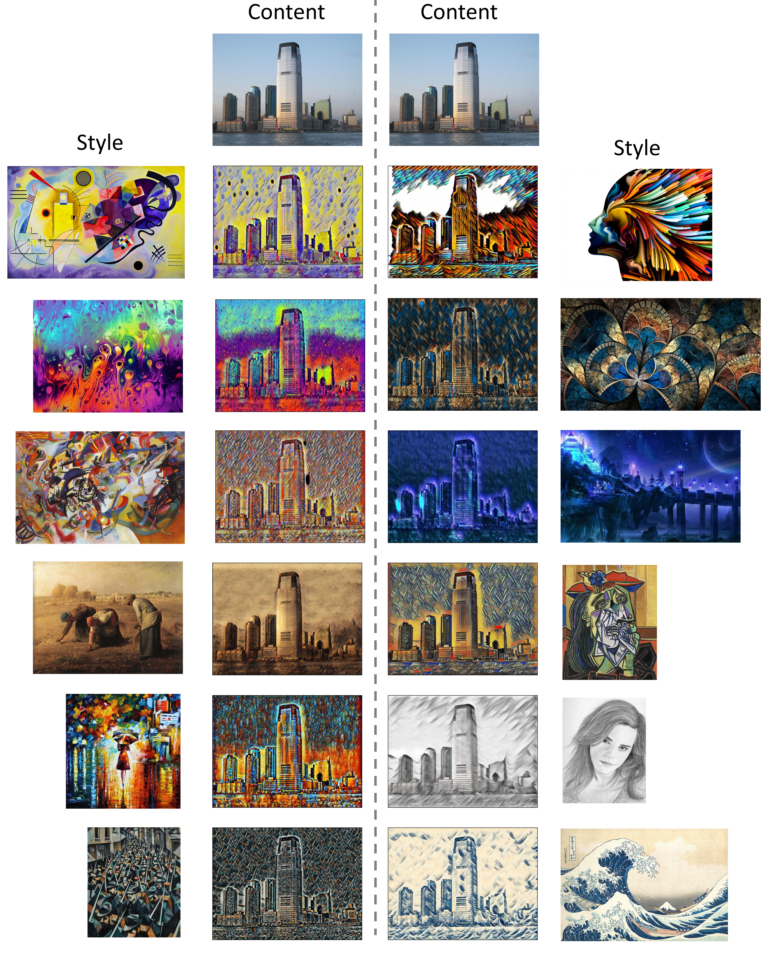

# fast-style-transfer-pytorch
Implementation of [Perceptual Losses for Real-Time Style Transfer and Super-Resolution](https://arxiv.org/abs/1603.08155) using __pytorch__.
  
## Results
You can see larger result images in `result/city`
<p align="center"></p>

## How to run
### Train
```
python train.py --trn_dir='data/train' --style_path='style/abstract_1.png', --lambda_s=500000
```
  
### Test
```
python test.py --weight_path='weight/abstract_1.weight', --content_path='content/city.png' --output_path='result/abstract_1.png'
```
  
### Implementation tips
#### 1. lambda_s
The loss function is `loss = lambda_c * content_loss + lambda_s * style_loss.`  
__lambda_s__ has a heavy influence on the result images. Following is the list of value I used.

Style image | lambda_s
----------- | ---------
abstract_1 | 1e+5
abstract_2 | 1e+5
abstract_3 | 1e+5
abstract_4 | 3e+5
composition | 2e+5
fantasy | 5e+5
monet | 5e+5
picaso | 1e+5
rain_princess | 1e+5
sketch | 5e+5
war | 3e+5
wave | 5e+5
  
#### 2. Normalization
In this implementation, __pretrained VGG__ is used. You can use it easily because pytorch provides it.
Normalization with __mean and std which were used in training VGG__ is necessary to get a best result.
__All images__(training images, content images, style images and result images of TransformationNet before going into VGG) are normalized with __mean = (0.485, 0.456, 0.406)__ and __std = (0.229, 0.224, 0.225).__
